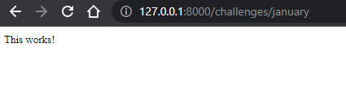
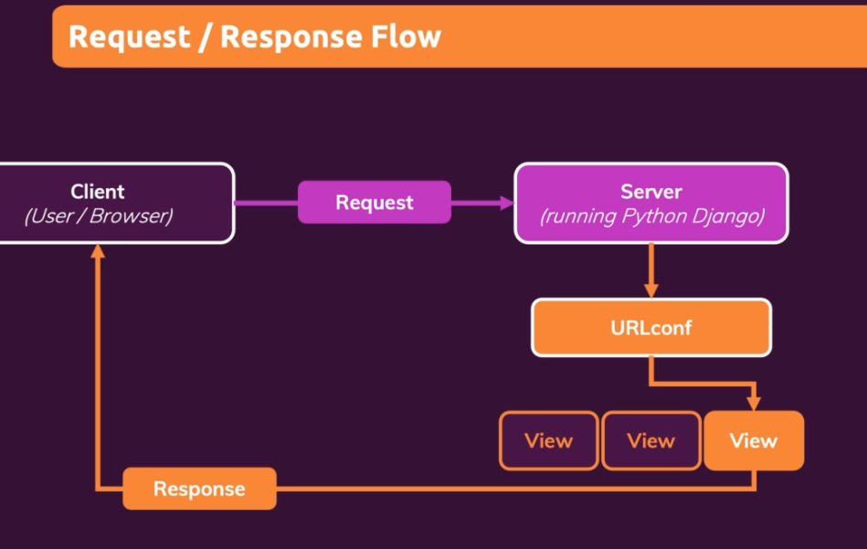
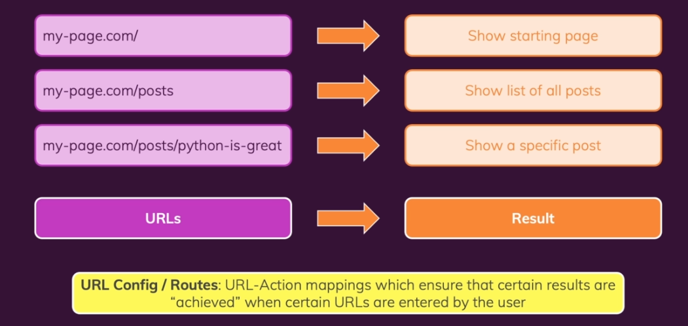
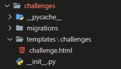

# Django

## [Python Notes](./00-notes/Python.md)

### Install Django

```bash
python3 -m pip install Django
```

> Check to make sure it's installed...

```bash
django-admin
```

#### Create a project

```bash
django-admin startproject mypage
```

#### Within the mypage directory that gets created:

```
- mypage/
    - manage.py
    - mypage/
        - __init__.py
        - settings.py
        - urls.py
        - asgi.py
        - wsgi.py
```

- The settings.py and urls.py files are the ones that we will be working with the most.

##### Start Development Server

```bash
python3 manage.py runserver

```

##### Create an app

```bash
python3 manage.py startapp challenges
```

### Activating virtual environment

**Open the Command Palette (Ctrl+Shift+P), then select the Python: Select Interpreter. From the list, select the virtual environment in your project folder that starts with .env.**

**Run Terminal: Create New Integrated Terminal (Ctrl+Shift+` or from the Command Palette), which creates a terminal and automatically activates the virtual environment by running its activation script.**

### Views:

- A view is either a function or a class.
- We do not call the view function directly... Django does this for us.

> Basic example of a view function:

```python
from django.shortcuts import render
from django.http import HttpResponse

# Create your views here.


def index(request):
    return HttpResponse("This works!")
```

Here the HttpResponse we are returning is an instance of the HttpResponse class. This class is defined in the django.http module. This module contains classes that handle requests and responses.

- In order for Django to know when to call the view function we need to create an adjacent file called `urls.py` in the same directory as the `views.py` file.

```py
from django.urls import path
from . import views
# UrlConfig
urlpatterns = [
    path("january", views.index)
]

```

1. from django.urls import path: This line imports the path function from the django.urls module. The path function is used to define URL patterns in Django.

2. from . import views: This line imports the views module from the current directory (denoted by the dot .). In Django, views are Python functions that handle HTTP requests and return HTTP responses.

3. urlpatterns = [...]: This line creates a list called urlpatterns which will store all the URL patterns for your Django project.

4. path("january", views.index): This line defines a URL pattern. It uses the path function to specify that any request to the "/january" URL should be handled by the index view function imported from the views module.

**In the global urls.py file**

```py
from django.contrib import admin
from django.urls import path, include

urlpatterns = [
    path("admin/", admin.site.urls),
    path("challenges/", include("challenges.urls"))
    ]
```

`path("challenges/", include("challenges.urls"))` tells us that we want to forward any requests that start with challenges/ to the challenges.urls module. This module will then handle the request further.

### When we forward from:

```py
    path("challenges/", include("challenges.urls"))
    # To...
    path("january", views.index)
```

- We end up with a url of `challenges/january`
- We get the following:





**Dynamic path Segments**

> Instead of:

```py
from django.urls import path
from . import views

# UrlConfig
urlpatterns = [
    path("january", views.january),
    path("february", views.february),
    path("march", views.march),
#...
]
```

> We can use angle brackets to signify any path that comes after challenges/

```py
from django.urls import path
from . import views

# UrlConfig
urlpatterns = [
    path("<month>", views.monthly_challenge)
]

```

> And we replace

```py
from django.shortcuts import render
from django.http import HttpResponse

# Create your views here.


def january(request):
    return HttpResponse("Eat no meat for the entire month!")


def february(request):
    return HttpResponse("Walk for at least 20 min every day!")


def march(request):
    return HttpResponse("Learn Django for at least 20 min every day!")

```

> With:

```py
from django.shortcuts import render
from django.http import HttpResponse

# Create your views here.

# Here month captures the dynamic path segments from
#urlpatterns = [
#    path("<month>", views.monthly_challenge)
#]

def monthly_challenge(request, month):
    return HttpResponse("This works for any month!")

```

**Revised views.py**

```py
from django.shortcuts import render
from django.http import HttpResponse, HttpResponseNotFound

# Create your views here.


def monthly_challenge(request, month):
    challenge_text = None
    if month == 'january':
        challenge_text = "Eat no meat for the entire month!"
    elif month == 'february':
        challenge_text = "Walk for at least 20 minutes every day!"
    elif month == 'march':
        challenge_text = "Learn Django for at least 20 minutes every day!"
    else:
        return HttpResponseNotFound("This month is not supported!")

    return HttpResponse(challenge_text)
```

**Telling Django what data type to expext in dynamic path segments**

```py
from django.urls import path
from . import views

# UrlConfig
urlpatterns = [
    path("<str:month>", views.monthly_challenge)
]
```

> The `<str:month>` tells Django to expect a string value in the month variable.

**Handlin month input as either string or number**

```py
# Views.py
from django.shortcuts import render
from django.http import HttpResponse, HttpResponseNotFound

# Create your views here.


def monthly_challenge_by_number(request, month):
    return HttpResponse(month)


def monthly_challenge(request, month):
    challenge_text = None
    if month == 'january':
        challenge_text = "Eat no meat for the entire month!"
    elif month == 'february':
        challenge_text = "Walk for at least 20 minutes every day!"
    elif month == 'march':
        challenge_text = "Learn Django for at least 20 minutes every day!"
    else:
        return HttpResponseNotFound("This month is not supported!")

    return HttpResponse(challenge_text)
```

```py
# Urls.py
from django.urls import path
from . import views

# UrlConfig
urlpatterns = [
    path("<int:month>", views.monthly_challenge_by_number),
    path("<str:month>", views.monthly_challenge)
]
```

### Redirects:

```py
from django.shortcuts import render
from django.http import (
    HttpResponse,
    HttpResponseNotFound,
    HttpResponseRedirect,
)


monthly_challenges = {
    "january": "Eat no meat for the entire month!",
    "february": "Walk for at least 20 minutes every day!",
    "march": "Learn Django for at least 20 minutes every day!",
    "april": "Read a book for 15 minutes every day!",
    "may": "Drink 8 glasses of water daily!",
    "june": "Practice meditation for 10 minutes every day!",
    "july": "No sugary drinks for the entire month!",
    "august": "Write a journal entry every day!",
    "september": "Learn a new language for 20 minutes daily!",
    "october": "Exercise for at least 30 minutes every day!",
    "november": "Limit screen time to 2 hours daily outside of work/school!",
    "december": "Volunteer or do a good deed daily!",
}


def monthly_challenge_by_number(request, month):
    months = list(monthly_challenges.keys())
    if month > len(months):
        return HttpResponseNotFound("Invalid month!")
    redirect_month = months[month - 1]
    return HttpResponseRedirect("/challenges/" + redirect_month)


def monthly_challenge(request, month):
    try:
        challenge_text = monthly_challenges[month]
    except KeyError:
        return HttpResponseNotFound("This month is not supported!")
    else:
        return HttpResponse(challenge_text)
```

> Now when we put in a number we get redirected to the correct month.

**Django Reverse & named URL patterns**

```py
from django.urls import path
from . import views

# UrlConfig
urlpatterns = [
    path("<int:month>", views.monthly_challenge_by_number),
    path("<str:month>", views.monthly_challenge, name="month-challenge"),
```

```py
from django.urls import reverse

#...
def monthly_challenge_by_number(request, month):
    months = list(monthly_challenges.keys())
    if month > len(months):
        return HttpResponseNotFound("Invalid month!")
    redirect_month = months[month - 1]
    redirect_path = reverse("month-challenge", args=[redirect_month])
    return HttpResponseRedirect(redirect_path)
#... rest of code
```

### Outputting html (using string interpolation)

```py
from django.shortcuts import render
from django.http import (
    HttpResponse,
    HttpResponseNotFound,
    HttpResponseRedirect,
)
from django.urls import reverse


monthly_challenges = {
    "january": "Eat no meat for the entire month!",
    "february": "Walk for at least 20 minutes every day!",
    "march": "Learn Django for at least 20 minutes every day!",
    "april": "Read a book for 15 minutes every day!",
    "may": "Drink 8 glasses of water daily!",
    "june": "Practice meditation for 10 minutes every day!",
    "july": "No sugary drinks for the entire month!",
    "august": "Write a journal entry every day!",
    "september": "Learn a new language for 20 minutes daily!",
    "october": "Exercise for at least 30 minutes every day!",
    "november": "Limit screen time to 2 hours daily outside of work/school!",
    "december": "Volunteer or do a good deed daily!",
}


def monthly_challenge_by_number(request, month):
    months = list(monthly_challenges.keys())
    if month > len(months):
        return HttpResponseNotFound("Invalid month!")
    redirect_month = months[month - 1]
    redirect_path = reverse("month-challenge", args=[redirect_month])
    return HttpResponseRedirect(redirect_path)


def monthly_challenge(request, month):
    try:
        challenge_text = monthly_challenges[month]
        response_data = f"<h1 style=\"color:blue\">{challenge_text}</h1>"
    except KeyError:
        return HttpResponseNotFound("This month is not supported!")
    else:
        return HttpResponse(response_data)
```

---

## URLS Views & Dynamic View Logic:

- urls and routes are basically the same concept and are used interchangeably.
- When we visit different urls we trigger actions and those actions are our views.
-

> views.py

```py
from django.shortcuts import render
from django.http import (
    HttpResponse,
    HttpResponseNotFound,
    HttpResponseRedirect,
)
from django.urls import reverse


monthly_challenges = {
    "january": "Eat no meat for the entire month!",
    "february": "Walk for at least 20 minutes every day!",
    "march": "Learn Django for at least 20 minutes every day!",
    "april": "Read a book for 15 minutes every day!",
    "may": "Drink 8 glasses of water daily!",
    "june": "Practice meditation for 10 minutes every day!",
    "july": "No sugary drinks for the entire month!",
    "august": "Write a journal entry every day!",
    "september": "Learn a new language for 20 minutes daily!",
    "october": "Exercise for at least 30 minutes every day!",
    "november": "Limit screen time to 2 hours daily outside of work/school!",
    "december": "Volunteer or do a good deed daily!",
}


def index(request):
    list_items = ""
    months = list(monthly_challenges.keys())

    for month in months:
        capitalized_month = month.capitalize()
        month_path = reverse("month-challenge", args=[month])
        list_items += f"<li><a href=\"{month_path}\">{capitalized_month}</a></li>"
    response_data = f"<ul>{list_items}</ul>"
    return HttpResponse(response_data)


def monthly_challenge_by_number(request, month):
    months = list(monthly_challenges.keys())
    if month > len(months):
        return HttpResponseNotFound("Invalid month!")
    redirect_month = months[month - 1]
    redirect_path = reverse("month-challenge", args=[redirect_month])
    return HttpResponseRedirect(redirect_path)


def monthly_challenge(request, month):
    try:
        challenge_text = monthly_challenges[month]
        response_data = f"<h1 style=\"color:blue\">{challenge_text}</h1>"
    except KeyError:
        return HttpResponseNotFound("<h2>This month is not supported!</h2>")
    else:
        return HttpResponse(response_data)
```

> urls.py

```py
from django.urls import path
from . import views

# UrlConfig
urlpatterns = [
    path("", views.index),
    path("<int:month>", views.monthly_challenge_by_number),
    path("<str:month>", views.monthly_challenge, name="month-challenge"),
]
```



---

---

## Templates & Static Files:

1. Create a new directory called templates in the challenges directory and create a subfolder called challenges inside the templates directory, create your html file in there.
2. inside your `views.py` import `from django.template.loader import render_to_string`
3. In views.py:

```py
def monthly_challenge(request, month):
    try:
        challenge_text = monthly_challenges[month]
        response_data = render_to_string("challenges/challenge.html")
    except KeyError:
        return HttpResponseNotFound("<h2>This month is not supported!</h2>")
    else:
        return HttpResponse(response_data)
```

- This alone won't work so we need to go into settings.py and add the following:

> This is not the best way to make Django aware of our templates folder...

```py
TEMPLATES = [
    {
        "BACKEND": "django.template.backends.django.DjangoTemplates",
        "DIRS": [
            BASE_DIR / "challenges" / "templates",
        ],
        "APP_DIRS": True,
        "OPTIONS": {
            "context_processors": [
                "django.template.context_processors.debug",
                "django.template.context_processors.request",
                "django.contrib.auth.context_processors.auth",
                "django.contrib.messages.context_processors.messages",
            ]
        },
    }
]
```

**A better way to make Django aware of our templates folder**

> The `"APP_DIRS": True,` line tells Django to look for a templates folder in each of our apps.

> still in the settings.py file:

```py
INSTALLED_APPS = [
    "challenges",
    "django.contrib.admin",
    "django.contrib.auth",
    "django.contrib.contenttypes",
    "django.contrib.sessions",
    "django.contrib.messages",
    "django.contrib.staticfiles",
]
```

where `challenges` is the name of our app in the apps.py file.

> apps.py

```py
from django.apps import AppConfig


class ChallengesConfig(AppConfig):
    default_auto_field = "django.db.models.BigAutoField"
    name = "challenges"
```



**Why the template is located in `challenges/templates/challenges/challenge.html`**
- It is considered best practice to repeat your app name in the templates folder because if you have multiple apps in your project, they might have similar template names and this will help avoid conflicts.
