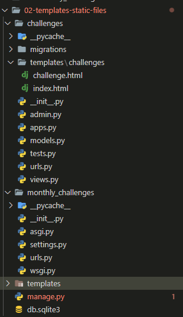
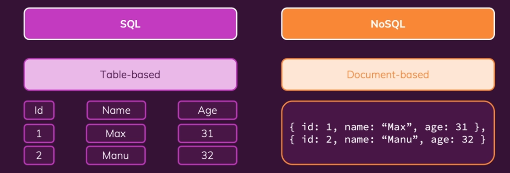

# Django

## [Python Notes](./00-notes/Python.md)

## [Django Docs](https://docs.djangoproject.com/en/4.2/intro/)

### Install Django

```bash
python3 -m pip install Django
```

> Check to make sure it's installed...

```bash
django-admin
```

#### Create a project

```bash
django-admin startproject mypage
```

#### Within the mypage directory that gets created:

```
- mypage/
    - manage.py
    - mypage/
        - __init__.py
        - settings.py
        - urls.py
        - asgi.py
        - wsgi.py
```

- The settings.py and urls.py files are the ones that we will be working with the most.

##### Start Development Server

```bash
python3 manage.py runserver

```

##### Create an app

```bash
python3 manage.py startapp challenges
```

### Activating virtual environment

**Open the Command Palette (Ctrl+Shift+P), then select the Python: Select Interpreter. From the list, select the virtual environment in your project folder that starts with .env.**

**Run Terminal: Create New Integrated Terminal (Ctrl+Shift+` or from the Command Palette), which creates a terminal and automatically activates the virtual environment by running its activation script.**

### Views:

- A view is either a function or a class.
- We do not call the view function directly... Django does this for us.

> Basic example of a view function:

```python
from django.shortcuts import render
from django.http import HttpResponse

# Create your views here.


def index(request):
    return HttpResponse("This works!")
```

Here the HttpResponse we are returning is an instance of the HttpResponse class. This class is defined in the django.http module. This module contains classes that handle requests and responses.

- In order for Django to know when to call the view function we need to create an adjacent file called `urls.py` in the same directory as the `views.py` file.

```py
from django.urls import path
from . import views
# UrlConfig
urlpatterns = [
    path("january", views.index)
]

```

1. from django.urls import path: This line imports the path function from the django.urls module. The path function is used to define URL patterns in Django.

2. from . import views: This line imports the views module from the current directory (denoted by the dot .). In Django, views are Python functions that handle HTTP requests and return HTTP responses.

3. urlpatterns = [...]: This line creates a list called urlpatterns which will store all the URL patterns for your Django project.

4. path("january", views.index): This line defines a URL pattern. It uses the path function to specify that any request to the "/january" URL should be handled by the index view function imported from the views module.

**In the global urls.py file**

```py
from django.contrib import admin
from django.urls import path, include

urlpatterns = [
    path("admin/", admin.site.urls),
    path("challenges/", include("challenges.urls"))
    ]
```

`path("challenges/", include("challenges.urls"))` tells us that we want to forward any requests that start with challenges/ to the challenges.urls module. This module will then handle the request further.

### When we forward from:

```py
    path("challenges/", include("challenges.urls"))
    # To...
    path("january", views.index)
```

- We end up with a url of `challenges/january`
- We get the following:


**Dynamic path Segments**

> Instead of:

```py
from django.urls import path
from . import views

# UrlConfig
urlpatterns = [
    path("january", views.january),
    path("february", views.february),
    path("march", views.march),
#...
]
```

> We can use angle brackets to signify any path that comes after challenges/

```py
from django.urls import path
from . import views

# UrlConfig
urlpatterns = [
    path("<month>", views.monthly_challenge)
]

```

> And we replace

```py
from django.shortcuts import render
from django.http import HttpResponse

# Create your views here.


def january(request):
    return HttpResponse("Eat no meat for the entire month!")


def february(request):
    return HttpResponse("Walk for at least 20 min every day!")


def march(request):
    return HttpResponse("Learn Django for at least 20 min every day!")

```

> With:

```py
from django.shortcuts import render
from django.http import HttpResponse

# Create your views here.

# Here month captures the dynamic path segments from
#urlpatterns = [
#    path("<month>", views.monthly_challenge)
#]

def monthly_challenge(request, month):
    return HttpResponse("This works for any month!")

```

**Revised views.py**

```py
from django.shortcuts import render
from django.http import HttpResponse, HttpResponseNotFound

# Create your views here.


def monthly_challenge(request, month):
    challenge_text = None
    if month == 'january':
        challenge_text = "Eat no meat for the entire month!"
    elif month == 'february':
        challenge_text = "Walk for at least 20 minutes every day!"
    elif month == 'march':
        challenge_text = "Learn Django for at least 20 minutes every day!"
    else:
        return HttpResponseNotFound("This month is not supported!")

    return HttpResponse(challenge_text)
```

**Telling Django what data type to expext in dynamic path segments**

```py
from django.urls import path
from . import views

# UrlConfig
urlpatterns = [
    path("<str:month>", views.monthly_challenge)
]
```

> The `<str:month>` tells Django to expect a string value in the month variable.

**Handlin month input as either string or number**

```py
# Views.py
from django.shortcuts import render
from django.http import HttpResponse, HttpResponseNotFound

# Create your views here.


def monthly_challenge_by_number(request, month):
    return HttpResponse(month)


def monthly_challenge(request, month):
    challenge_text = None
    if month == 'january':
        challenge_text = "Eat no meat for the entire month!"
    elif month == 'february':
        challenge_text = "Walk for at least 20 minutes every day!"
    elif month == 'march':
        challenge_text = "Learn Django for at least 20 minutes every day!"
    else:
        return HttpResponseNotFound("This month is not supported!")

    return HttpResponse(challenge_text)
```

```py
# Urls.py
from django.urls import path
from . import views

# UrlConfig
urlpatterns = [
    path("<int:month>", views.monthly_challenge_by_number),
    path("<str:month>", views.monthly_challenge)
]
```

### Redirects:

```py
from django.shortcuts import render
from django.http import (
    HttpResponse,
    HttpResponseNotFound,
    HttpResponseRedirect,
)


monthly_challenges = {
    "january": "Eat no meat for the entire month!",
    "february": "Walk for at least 20 minutes every day!",
    "march": "Learn Django for at least 20 minutes every day!",
    "april": "Read a book for 15 minutes every day!",
    "may": "Drink 8 glasses of water daily!",
    "june": "Practice meditation for 10 minutes every day!",
    "july": "No sugary drinks for the entire month!",
    "august": "Write a journal entry every day!",
    "september": "Learn a new language for 20 minutes daily!",
    "october": "Exercise for at least 30 minutes every day!",
    "november": "Limit screen time to 2 hours daily outside of work/school!",
    "december": "Volunteer or do a good deed daily!",
}


def monthly_challenge_by_number(request, month):
    months = list(monthly_challenges.keys())
    if month > len(months):
        return HttpResponseNotFound("Invalid month!")
    redirect_month = months[month - 1]
    return HttpResponseRedirect("/challenges/" + redirect_month)


def monthly_challenge(request, month):
    try:
        challenge_text = monthly_challenges[month]
    except KeyError:
        return HttpResponseNotFound("This month is not supported!")
    else:
        return HttpResponse(challenge_text)
```

> Now when we put in a number we get redirected to the correct month.

**Django Reverse & named URL patterns**

```py
from django.urls import path
from . import views

# UrlConfig
urlpatterns = [
    path("<int:month>", views.monthly_challenge_by_number),
    path("<str:month>", views.monthly_challenge, name="month-challenge"),
```

```py
from django.urls import reverse

#...
def monthly_challenge_by_number(request, month):
    months = list(monthly_challenges.keys())
    if month > len(months):
        return HttpResponseNotFound("Invalid month!")
    redirect_month = months[month - 1]
    redirect_path = reverse("month-challenge", args=[redirect_month])
    return HttpResponseRedirect(redirect_path)
#... rest of code
```

### Outputting html (using string interpolation)

```py
from django.shortcuts import render
from django.http import (
    HttpResponse,
    HttpResponseNotFound,
    HttpResponseRedirect,
)
from django.urls import reverse


monthly_challenges = {
    "january": "Eat no meat for the entire month!",
    "february": "Walk for at least 20 minutes every day!",
    "march": "Learn Django for at least 20 minutes every day!",
    "april": "Read a book for 15 minutes every day!",
    "may": "Drink 8 glasses of water daily!",
    "june": "Practice meditation for 10 minutes every day!",
    "july": "No sugary drinks for the entire month!",
    "august": "Write a journal entry every day!",
    "september": "Learn a new language for 20 minutes daily!",
    "october": "Exercise for at least 30 minutes every day!",
    "november": "Limit screen time to 2 hours daily outside of work/school!",
    "december": "Volunteer or do a good deed daily!",
}


def monthly_challenge_by_number(request, month):
    months = list(monthly_challenges.keys())
    if month > len(months):
        return HttpResponseNotFound("Invalid month!")
    redirect_month = months[month - 1]
    redirect_path = reverse("month-challenge", args=[redirect_month])
    return HttpResponseRedirect(redirect_path)


def monthly_challenge(request, month):
    try:
        challenge_text = monthly_challenges[month]
        response_data = f"<h1 style=\"color:blue\">{challenge_text}</h1>"
    except KeyError:
        return HttpResponseNotFound("This month is not supported!")
    else:
        return HttpResponse(response_data)
```

---

## URLS Views & Dynamic View Logic:

- urls and routes are basically the same concept and are used interchangeably.
- When we visit different urls we trigger actions and those actions are our views.
-

> views.py

```py
from django.shortcuts import render
from django.http import (
    HttpResponse,
    HttpResponseNotFound,
    HttpResponseRedirect,
)
from django.urls import reverse


monthly_challenges = {
    "january": "Eat no meat for the entire month!",
    "february": "Walk for at least 20 minutes every day!",
    "march": "Learn Django for at least 20 minutes every day!",
    "april": "Read a book for 15 minutes every day!",
    "may": "Drink 8 glasses of water daily!",
    "june": "Practice meditation for 10 minutes every day!",
    "july": "No sugary drinks for the entire month!",
    "august": "Write a journal entry every day!",
    "september": "Learn a new language for 20 minutes daily!",
    "october": "Exercise for at least 30 minutes every day!",
    "november": "Limit screen time to 2 hours daily outside of work/school!",
    "december": "Volunteer or do a good deed daily!",
}


def index(request):
    list_items = ""
    months = list(monthly_challenges.keys())

    for month in months:
        capitalized_month = month.capitalize()
        month_path = reverse("month-challenge", args=[month])
        list_items += f"<li><a href=\"{month_path}\">{capitalized_month}</a></li>"
    response_data = f"<ul>{list_items}</ul>"
    return HttpResponse(response_data)


def monthly_challenge_by_number(request, month):
    months = list(monthly_challenges.keys())
    if month > len(months):
        return HttpResponseNotFound("Invalid month!")
    redirect_month = months[month - 1]
    redirect_path = reverse("month-challenge", args=[redirect_month])
    return HttpResponseRedirect(redirect_path)


def monthly_challenge(request, month):
    try:
        challenge_text = monthly_challenges[month]
        response_data = f"<h1 style=\"color:blue\">{challenge_text}</h1>"
    except KeyError:
        return HttpResponseNotFound("<h2>This month is not supported!</h2>")
    else:
        return HttpResponse(response_data)
```

> urls.py

```py
from django.urls import path
from . import views

# UrlConfig
urlpatterns = [
    path("", views.index),
    path("<int:month>", views.monthly_challenge_by_number),
    path("<str:month>", views.monthly_challenge, name="month-challenge"),
]
```


---

---

## Templates & Static Files:

1. Create a new directory called templates in the challenges directory and create a subfolder called challenges inside the templates directory, create your html file in there.
2. inside your `views.py` import `from django.template.loader import render_to_string`
3. In views.py:

```py
def monthly_challenge(request, month):
    try:
        challenge_text = monthly_challenges[month]
        response_data = render_to_string("challenges/challenge.html")
    except KeyError:
        return HttpResponseNotFound("<h2>This month is not supported!</h2>")
    else:
        return HttpResponse(response_data)
```

- This alone won't work so we need to go into settings.py and add the following:

> This is not the best way to make Django aware of our templates folder...

```py
TEMPLATES = [
    {
        "BACKEND": "django.template.backends.django.DjangoTemplates",
        "DIRS": [
            BASE_DIR / "challenges" / "templates",
        ],
        "APP_DIRS": True,
        "OPTIONS": {
            "context_processors": [
                "django.template.context_processors.debug",
                "django.template.context_processors.request",
                "django.contrib.auth.context_processors.auth",
                "django.contrib.messages.context_processors.messages",
            ]
        },
    }
]
```

**A better way to make Django aware of our templates folder**

> The `"APP_DIRS": True,` line tells Django to look for a templates folder in each of our apps.

> still in the settings.py file:

```py
INSTALLED_APPS = [
    "challenges",
    "django.contrib.admin",
    "django.contrib.auth",
    "django.contrib.contenttypes",
    "django.contrib.sessions",
    "django.contrib.messages",
    "django.contrib.staticfiles",
]
```

where `challenges` is the name of our app in the apps.py file.

> apps.py

```py
from django.apps import AppConfig


class ChallengesConfig(AppConfig):
    default_auto_field = "django.db.models.BigAutoField"
    name = "challenges"
```


**Why the template is located in `challenges/templates/challenges/challenge.html`**

- It is considered best practice to repeat your app name in the templates folder because if you have multiple apps in your project, they might have similar template names and this will help avoid conflicts.

---

### Django Template Language (DTL):

### [Docs](https://docs.djangoproject.com/en/4.2/ref/templates/language/)

> here we add a dictonary to the render method that provides the context for the template.

```py
def monthly_challenge(request, month):
    try:
        challenge_text = monthly_challenges[month]
        return render(request, "challenges/challenge.html", {
            "text": challenge_text,
            "month_name": month.capitalize()
        })
    except KeyError:
        return HttpResponseNotFound("<h2>This month is not supported!</h2>")
```

- We can then access the context in the template using the `{{ }}` syntax.

```html
<!doctype html>
<html lang="en">
  <head>
    <meta charset="UTF-8" />
    <meta name="viewport" content="width=device-width, initial-scale=1.0" />
    <title>Monthly Challenge</title>
  </head>
  <body>
    <h1>This Month's Challenge</h1>
    <h2>{{text}}</h2>
  </body>
</html>
```

- **Note** you cannot exicute python code inside of the `{{ }}` syntax.

**Django Template Language (DTL) Filters**

- [Docs](https://docs.djangoproject.com/en/4.2/ref/templates/builtins/#ref-templates-builtins-filters)

Example:

```html
<h1>{{month_name | title}} Challenge</h1>
```

- Here this outputs the month name with the first letter of each word capitalized.

**Django Template Language (DTL) Tags**

- [Docs](https://docs.djangoproject.com/en/4.2/ref/templates/builtins/#ref-templates-builtins-tags)

**for tag example**

```html

<li><a href="/challenges/{{ month }}"> {{ month |title }}</a></li>

```

**With dynamic links**

```html

<li><a href=""> {{ month |title }}</a></li>

```

- Where `month-challenge` is the name of the url pattern in the urls.py file and `month` is the variable we are passing to the url pattern.
  > also seen here:

```py
def monthly_challenge_by_number(request, month):
    months = list(monthly_challenges.keys())
    if month > len(months):
        return HttpResponseNotFound("Invalid month!")
    redirect_month = months[month - 1]
    redirect_path = reverse("month-challenge", args=[redirect_month])
    return HttpResponseRedirect(redirect_path)
```

**If tag**

```html

<p>Welcome, {{ user.username }}!</p>

<p>Please <a href="">login</a>.</p>

```

**Template Inheritance**

> We will put our general templates in the root directory of the project because they may be shared across multiple apps.
> 

- In our base template:

```html
<!doctype html>
<html lang="en">
  <head>
    <meta charset="UTF-8" />
    <meta name="viewport" content="width=device-width, initial-scale=1.0" />
    <title>My Challenges</title>
  </head>
  <body>
    
  </body>
</html>
```

- The `<title>My Challenges</title>` block is a placeholder where we can inject content from other templates.

- In the example above `My Challenges` is the default fallback value if no other value is provided.

> in settings.py

```py
TEMPLATES = [
    {
        "BACKEND": "django.template.backends.django.DjangoTemplates",
        "DIRS": [
             BASE_DIR / "templates",
        ],
        "APP_DIRS": True,
        "OPTIONS": {
            "context_processors": [
                "django.template.context_processors.debug",
                "django.template.context_processors.request",
                "django.contrib.auth.context_processors.auth",
                "django.contrib.messages.context_processors.messages",
            ]
        },
    }
]
```

> we set the BASE_DIR to the templates folder in the root directory of the project.
> Now in our index.html we can extend the base template.

```html
  All Challenges 

<ul style="font-weight: bold">
  
  <li><a href=""> {{ month |title }}</a></li>
  
</ul>

```

**How to use partials in Django Templates**

```html

```

- In the header we can make the links dynamic by using the `url` tag.

> urls.py:

```py
from django.urls import path
from . import views

# UrlConfig
urlpatterns = [
    path("", views.index, name="index"),
    path("<int:month>", views.monthly_challenge_by_number),
    path("<str:month>", views.monthly_challenge, name="month-challenge"),
]
```

Now that we gave the index view a name we can use it in the url tag.

```html
<header>
    <nav>
        <a href="">All Challenges</a>
    </nav>
</header>

```

- It is important to note that an included html snippet will inherit the context of the template it is included in... (i.e. pageName etc...).

---

### More on Django Template Language (DTL):

#### Accessing Dictionary Fields in Templates

When accessing dictionary data in a template, you DON'T use this syntax:

**{{ myDictionary\['some\_key'\] }}**

Instead, you use the dot notation - as if it were a regular Python object:

**{{ myDictionary.some\_key }}**

This might look strange, but keep in mind, that the DTL is a custom-made language. It looks like Python, but ultimately it is NOT Python - it's a language parsed and executed by Django. Hence, its syntax can deviate - just as it does here.

Again, you'll see this in action later in the course!

#### Calling Functions in Templates

Calling functions in templates also works differently than it does in Python.

Instead of calling it, you use functions like regular variables or properties.

I.e., instead of:

**{{ result\_from\_a\_function() }}**

you would use

**{{ result\_from\_a\_function }}**

---

### 404 Template Page:

> `templates/404.html`

```html
  Something webt wrong, we could
not find that page!  
<h1>We could not find that page!</h1>
<p>
  Sorry about that, we could not find the page you were looking for. Please try
  again.
</p>

```

> `views.py`

```py
from django.template.loader import render_to_string
#...
def monthly_challenge(request, month):
    try:
        challenge_text = monthly_challenges[month]
        return render(
            request,
            "challenges/challenge.html",
            {"text": challenge_text, "month_name": month},
        )
    except KeyError:
        response_data = render_to_string("404.html")
        return HttpResponseNotFound(response_data)
```

**Alternative way to handle 404 errors**

```py
from django.http import Http404
def monthly_challenge(request, month):
    try:
        challenge_text = monthly_challenges[month]
        return render(
            request,
            "challenges/challenge.html",
            {"text": challenge_text, "month_name": month},
        )
    except KeyError:
        raise Http404()
```

---

#### Adding Static Files:

- First in the `settings.py` we need to ensure `"django.contrib.staticfiles",` is in the `INSTALLED_APPS` list. It should be by default but if it is not add it.

```py
INSTALLED_APPS = [
    "challenges",
    "django.contrib.admin",
    "django.contrib.auth",
    "django.contrib.contenttypes",
    "django.contrib.sessions",
    "django.contrib.messages",
    "django.contrib.staticfiles",
]
```

- Then we create a directory called `static` in the root directory of the project and add another directory called `challenges` within it (in this case...).

> base.html

```html
<!doctype html>
<html lang="en">
  <head>
    <meta charset="UTF-8" />
    <meta name="viewport" content="width=device-width, initial-scale=1.0" />
    <title>My Challenges</title>
     
  </head>
  <body>
    
  </body>
</html>
```

> index.html

```html




<link rel="stylesheet" href="">



 All Challenges 



<ul style="font-weight: bold">
  
  <li><a href=""> {{ month |title }}</a></li>
  
</ul>

```

**How to load global styles from a static folder in the root directory of the project**

> settings.py

```py
STATICFILES_DIRS = [
    BASE_DIR / "static",
]
```

### NOTE TO SELF:

- When you are working with static css files... if you don't see your changes reflected try clearing your cache and reloading the page (ctrl + shift + del) in chrome.

---

### Building Static URLs Dynamically

> Imagine, that you want to build a static URL where some part of the URL (e.g. the filename) is actually stored in a variable that's exposed to the template.

So you might want to build the URL like this:

****

Here, "**the_file**" would be a variable holding the actual filename.

The above code would fail.

Instead, you can use the "**add**" filter provided by Django to construct this path dynamically:

****

---

---

## Building a Blog with Django:

> blog/urls.py:

```py
from django.urls import path
from . import views

urlpatterns = [
    path("", views.starting_page, name="starting-page"),
    path("posts", views.posts, name="posts-page"),
    path("posts/<slug:slug>", views.post_detail, name="post-detail-page")
]

```

- The `<slug:slug>` is a dynamic path segment that will be used to identify a blog post with a slug of the format `my-post-title` or in other words alphanumerical characters separated by dashes.

---
---

## Data & Models:

### Databases:
- There are two kinds of databases:
    - SQL - store data in tables
    - NoSQL - store data as documents in collections




- In SQL all entires in a table must have the same exact set of fields... douments in a noSQL collection don't have as strict a set of rules.

**Examples of engines for each:**

> SQL: mySQL, PostgreSQL, SQLite
> NoSQL: MongoDB, CassandraDB


